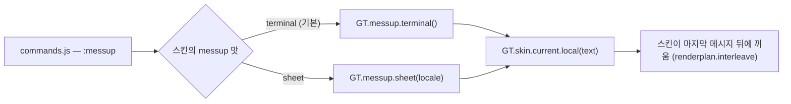

# sheet 스킨의 `:messup` — 스프레드시트다운 가짜 출력

작성: 2026-10-01 · 상태: **구현됨 (0.18.0)** — 결정: 진짜 응답의 표도 칸으로 나눈다 · 차오르는 연출은 넣지 않는다

목업(누를 때마다 새로 뽑는 생성기 초안 포함): https://claude.ai/artifact/M82zgugb6eKRygdiKReRqD (비공개)

---

## 1. 지금 `[확정 — 코드]`

| 무엇 | 어디 | 내용 |
|---|---|---|
| 명령 | `src/content/commands.js:520` | `:messup [횟수\|clear]`. 최대 10개. 생성기 `messup()` 이 마크다운 한 덩어리를 만들어 `GT.skin.current.local(text)` 로 넘긴다 |
| 생성기 | `commands.js:459-518` | 제목 `### reticulating kernel · a3f9c1` + 산문 목록 + ```` ```log ```` 빌드 로그 + ```` ```ts ```` 코드 + 50% 확률로 표. **터미널 빌드 로그 모양** |
| terminal | `terminal.js:22, 386, 753` | `localLog` 에 `{id, anchorKey, at, text}` 를 쌓고, 넣을 때의 마지막 메시지 뒤에 끼운다(`GT.renderplan.interleave`). 메타줄 `⏺ local · :messup — 화면에만 있는 출력` |
| sheet | `sheet.js:728` | `hiddenCommands: [':messup']`. `local()` 은 아무것도 안 하고 0. 직접 치면 "지금 스킨(시트)에서는 쓸 수 없는 명령입니다" (`commands.js:555`) |
| none | `none.js:210` | `:messup` 숨김 — 이번 범위 아님 |
| 심사 노트 | `docs/store/review-notes.md` (e) | "사용자가 직접 실행할 때만 · '화면에만 있는 출력' 라벨과 점선 표시 · ChatGPT 로 안 감 · 대화 기록에 안 남음 · `:messup clear` 로 지움" 을 약속했다 |

용도는 생성기 주석 그대로 "바쁜 척하는 용도 — '있어 보이는' 모양" 이다. sheet 에서는 **빌드 로그 대신
스프레드시트 작업 중인 것처럼** 보여야 한다.

## 2. "스프레드시트다운 값" 이란

조사 기준: 스프레드시트를 많이 쓰는 사람이 화면을 스쳐 봤을 때 "계산 돌리는 중" 으로 읽히는 것.
진짜처럼 보이게 하는 건 **단어가 아니라 서식**이다.

| 요소 | 예 | 왜 |
|---|---|---|
| 셀 주소 · 범위 | `B7` · `$A$1:$H$4812` · `매출_3분기!$C:$C` | 절대참조 `$` 와 `시트!범위` 가 가장 스프레드시트스럽다 |
| 수식 | `=XLOOKUP($B7, 거래처!$A:$A, 거래처!$F:$F, "없음")` · `=SUMIFS(D:D, B:B, "수도권", C:C, ">="&$H$1)` · `=IFERROR(F7/E7-1, 0)` | 함수 이름과 인자 구분이 바로 알아보인다 |
| 숫자 서식 | `₩12,480,000` · `(1,240,000)` · `▲ 4.2%` · `0.873` | 천 단위 쉼표, 회계 서식의 괄호 음수, 증감 화살표 |
| 오류값 | `#N/A` · `#DIV/0!` · `#REF!` | 스프레드시트에만 있는 글자. "처리됨" 과 붙여 쓰면 일하는 중으로 보인다 |
| 작업 이름 | 피벗 테이블 새로 고침 · 다시 계산 · 조건부 서식 · 데이터 유효성 검사 · 외부 연결 새로 고침 · 파워 쿼리 단계 적용 | 메뉴에 실제로 있는 동작들 |
| 상태 줄 | `계산 중 (8 스레드) … 63%` · `셀 12,480개 다시 계산 · 214.3ms` · `휘발성 함수 3개 (NOW · OFFSET · INDIRECT)` · `순환 참조 0` | 하단 상태 표시줄의 "계산 중" 을 흉내 |
| 매크로 | `Sub 재계산_3fa9()` … `Application.Calculation = xlCalculationManual` … `End Sub` | 터미널판의 ts 코드 자리 |

### 쓰지 않는 것

- **제품 이름(Excel · Microsoft · Google Sheets)은 출력에 넣지 않는다.** 심사에서 상표·사칭으로 읽힐 수 있다.
  함수 이름(`XLOOKUP` 등)과 VBA 식별자는 그대로 쓴다 — 여러 스프레드시트가 공유하는 일반 어휘다 `[가정]`
- **실제 사용자 데이터처럼 보이는 개인 정보**(사람 이름 · 전화번호 · 주민번호 모양)는 넣지 않는다. 지역 · 분기 · 품목 같은
  일반 범주만 쓴다
- 반말 종결어미. 산문은 명사형이나 존댓말로 끝낸다 (`test/store.listing.test.mjs` 의 존댓말 검사 대상)

## 3. 한 블록의 모양

블록 하나 = "작업 하나". 격자의 행으로 이렇게 펴진다(열: 행번호 · A 누가 · B 내용 · C 시각).

```
 #  │ A      │ B                                                            │ C
────┼────────┼──────────────────────────────────────────────────────────────┼──────
 21 │ local  │ :messup — 화면에만 있는 출력 · 서버로 가지 않습니다             │ 14:26   ← 라벨 행 (심사 약속)
 22 │        │ 피벗 테이블 새로 고침 · 매출_3분기!$A$1:$H$4812                │         ← 제목
 23 │        │ fx  =SUMIFS(D:D, B:B, "수도권", C:C, ">="&$H$1)               │         ← 수식 행
 24 │        │ fx  =IFERROR(F7/E7-1, 0)                                      │
 25 │        │ 계산 중 (8 스레드) ··········· 63%                             │         ← 상태 로그
 26 │        │ 셀 12,480개 다시 계산 · 214.3ms                                │
 27 │        │ #N/A 4건 → IFERROR 로 처리됨 · 순환 참조 0                      │
 28 │        │ 지역     │      합계      │ 전월 대비                            │         ← 요약 표 (머리)
 29 │        │ 수도권   │  ₩12,480,000  │   ▲ 4.2%                            │
 30 │        │ 영남     │   (1,240,000) │   ▼ 1.8%                            │
 31 │        │ 합계     │  ₩38,912,400  │   ▲ 2.1%                            │
 32 │        │ · 조건부 서식 규칙 3개 적용 · 데이터 유효성 검사 통과             │         ← 항목
 33 │        │ · 다음 작업: 피벗 캐시 압축 (예상 412.6ms)                       │
```

50% 확률로 요약 표 대신(또는 더해) 매크로 블록이 붙는다.

```
Sub 재계산_3fa9()
    Application.Calculation = xlCalculationManual
    Range("B2:H4812").Calculate
    ThisWorkbook.RefreshAll
    Application.Calculation = xlCalculationAutomatic
End Sub
```

### 표시

- **블록 전체를 "복사한 범위" 의 움직이는 점선(marching ants)으로 두른다.** 스프레드시트에서 점선 테두리는
  "임시로 떠 있는 것" 이라는 뜻이라, 심사 노트가 약속한 "점선 표시" 를 이 스킨의 말로 지킨다.
  `prefers-reduced-motion` 이면 움직이지 않는 점선
- 라벨 행: A 열 `local`(경고색), B 열은 흐린 기울임. terminal 의 `⏺ local` 메타줄과 같은 뜻
- 수식 행: B 앞에 `fx` 칩 + 고정폭. 지금 코드블록(`data-kind="code"`)과 같은 회색 바탕
- 요약 표: **진짜 칸으로 나눈다** — 지금 sheet 는 표 행을 `a | b | c` 한 줄 글자로 보여 준다. 가짜 출력의 표만
  칸을 나누고 숫자를 오른쪽 정렬한다(회계 서식이 살아야 진짜처럼 보인다). 진짜 응답의 표까지 바꾸는 것은 범위 밖 —
  하고 싶으면 따로 정한다
- 셀 고르기 · 방향키 · 복사는 다른 행과 똑같이 된다

## 4. 구조

### 생성기를 명령에서 떼어 낸다



- 새 파일 `src/content/messup.js` — 생성기 둘(`terminal` · `sheet`)을 순수 함수로. 지금 `commands.js` 의
  생성기를 옮긴다(내용은 그대로). 테스트가 직접 부른다
- 스킨 계약에 선택 필드 `messup: 'terminal' | 'sheet'` 를 더한다(`skin.js` 의 `FIELDS`). 없으면 `terminal`.
  스킨이 랜덤 글을 직접 들고 있지 않게 한다
- 결과는 지금처럼 **마크다운 한 덩어리**. sheet 전용 모양은 코드 펜스 이름으로 전한다 —
  ```` ```formula ```` (수식 행) · ```` ```calc ```` (상태 로그) · ```` ```vba ```` (매크로). 마크다운 파서는 고치지 않는다
- `manifest.json` 의 콘텐츠 스크립트 목록에 `messup.js` 를 `commands.js` 앞에 넣는다

### sheet 쪽

- `localLog` · `local()` · `clearLocal()` 을 terminal 과 같은 모양으로 (`{id, anchorKey, at, text}`)
- `plan()` 이 메시지 키 순서에 `GT.renderplan.interleave` 로 블록을 끼운다 — terminal 과 같은 순서 규칙
- 블록 → 행: `GT.markdown.lines(text)` 로 편 뒤 맨 앞에 라벨 행을 붙이고 모든 행에 `local: true`
- 행 키 `l:<id>:<i>`. 서명에 `epoch` 를 넣어 글꼴·테마가 바뀌면 다시 그린다
- `hiddenCommands` 에서 `:messup` 을 뺀다. `:clear` 는 이미 `clearLocal()` 을 부른다

### 문구

- 라벨(`:messup — 화면에만 있는 출력 · 서버로 가지 않습니다`)은 `i18n.js` 사전에 ko · en
- 가짜 출력의 어휘(작업 이름 · 지역 · 시트 이름 · 통화)는 `messup.js` 안에 ko · en 두 벌. 사전에 넣지 않는다 —
  번역할 문장이 아니라 무작위로 고르는 단어 목록이다. 통화 기호는 ko `₩` · en `$`

## 5. 바뀌는 파일

| 파일 | 변경 |
|---|---|
| `src/content/messup.js` | 새 파일 — 생성기 둘 |
| `src/content/commands.js` | 생성기를 빼고 `GT.messup[...]` 를 부른다 |
| `src/content/shell/skin.js` | 계약 `FIELDS` 에 `messup` |
| `src/content/skins/sheet.js` | `local` · `clearLocal` · `plan` 끼우기 · 라벨/수식/표 행 그리기 · 점선 CSS · `hiddenCommands: []` · `messup: 'sheet'` |
| `src/shared/i18n.js` | 라벨 문구 ko · en |
| `manifest.json` | 콘텐츠 스크립트에 `messup.js` · 버전 **MINOR** (새 기능) |
| `docs/store/review-notes.md` (e) | "terminal view" → terminal · sheet, 점선이 sheet 에서는 움직이는 점선이라는 것 |

## 6. 회귀 테스트 계획

- `test/messup.test.mjs`
  - sheet 생성기: 수식 펜스 · 셀 범위(`$`) · 통화 서식 · 오류값 중 하나 이상이 들어 있다 · 매번 다르다
  - 출력에 제품 이름(`Excel` · `Microsoft` · `Sheets`)이 없다
  - 반말 종결이 없다
  - terminal 생성기는 예전과 같은 모양(옮기기만 했는지)
- `test/sheet.test.mjs`
  - `:messup` 을 숨기지 않는다
  - 블록이 넣을 때의 마지막 메시지 뒤에 끼워진다 · 새 메시지가 와도 제자리
  - 첫 행이 라벨 행(`local` + 화면에만 있는 출력)이다
  - 표 행은 칸이 나뉘고 숫자 칸이 오른쪽 정렬이다
  - `clearLocal` · `:clear` 로 사라진다
- 새 검사는 해당 코드를 되돌려 실패하는지 확인한다

## 7. 결정 · 남은 것

- **진짜 응답의 표도 칸으로 나눈다** (사용자 결정, 0.18.0). 한 표(머리 행부터 이어지는 표 행)의 칸 너비를 글자 폭으로
  재서 모든 행에 같은 `grid-template-columns` 를 준다 — 행 단위 렌더를 지킨 채 세로줄이 맞는다.
  숫자 칸(통화 · 회계 괄호 · 증감 · %)은 오른쪽 정렬 · 줄바꿈 안 함. 표 행을 복사하면 칸을 탭으로 잇는다
- **차오르는 연출은 넣지 않는다** (사용자 결정). 정적 출력
- **[미정]** 움직이는 점선이 화면 밖 행(`content-visibility: auto`)에서도 도는지 재지 않았다. 블록은 최대 10개
- **[가정]** 함수 이름 · VBA 식별자는 상표 문제가 없다. 제품 이름은 출력에 넣지 않았고 심사 노트에 적었다
- **[미정]** 실제 ChatGPT 답의 표에서 칸 너비가 적당한지는 하네스 표 하나와 가짜 출력으로만 봤다

## 8. 구현하며 실측한 것 (하네스, 헤드리스 크롬 153)

- 같은 표의 행끼리 칸의 왼쪽 좌표가 같다 (`116 · 174 · 267px`) — 세로줄이 맞는다
- `₩` · `▲` 를 한 칸으로 셌더니 `₩15,009,000` 이 칸 안에서 두 줄로 꺾였다 → U+2000 이상 기호를 두 칸으로 센다
- 수식 행 칩에 `.gs-fx` 를 썼더니 그 이름이 **수식 입력줄의 클래스**라 칩이 한 줄(26px, flex)을 차지하고,
  거꾸로 수식 입력줄이 기울임 · 강조색이 됐다 → `.gs-fxchip` 으로 바꿨다
- 고른 행이 사라질 때(블록 걷어내기 · 명령 결과 지우기) `paintSel` 이 `CSS.escape` 에서 TypeError —
  이 파일의 `CSS` 는 스타일 문자열이었다(0.8.0 부터). `window.CSS.escape` 로 고쳤다
